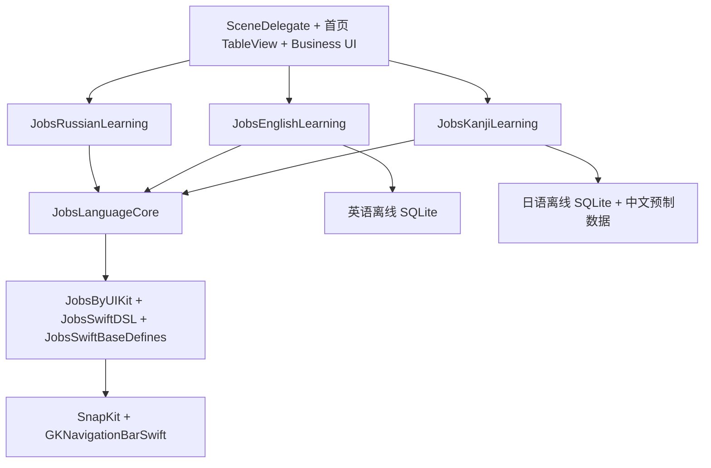
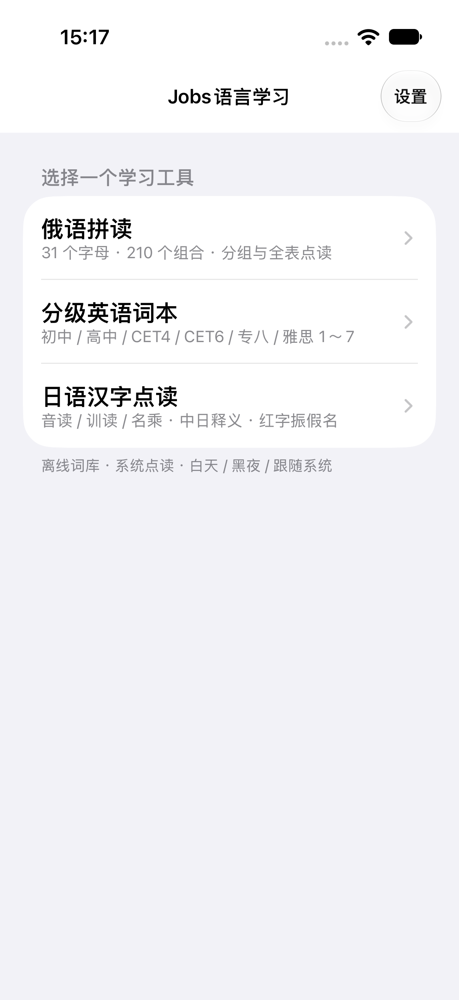
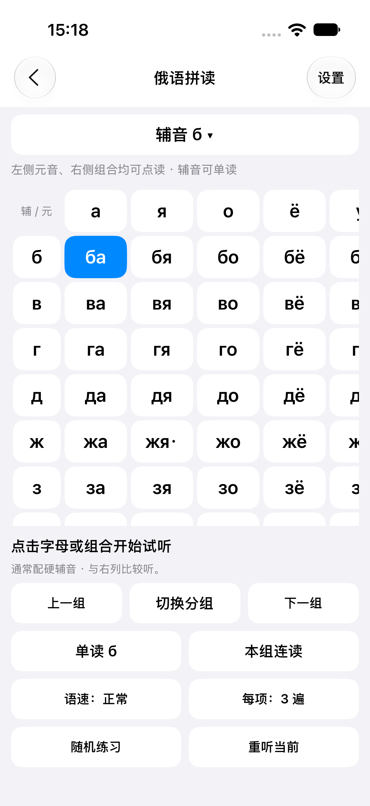
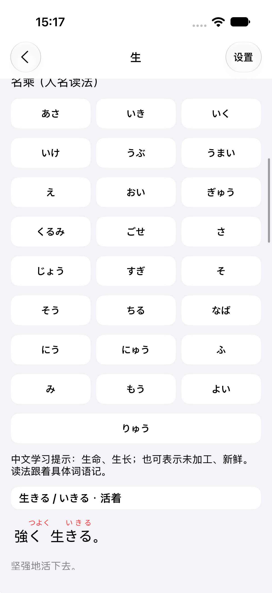

# JobsLanguageLearning · Jobs语言学习


[toc]

---

[▶ 观看Jobs语言学习演示视频](./showMeNow.mp4)

https://github.com/user-attachments/assets/26dbbee0-261b-4f5b-b9f1-43260d51d281

## 🔥 <font id=前言>前言</font>

使用 [**Swift**](https://www.swift.org/) 编写的独立 iPhone / iPad App。启动直接进入 TableView，三个 Cell 分别打开俄语拼读、分级英语词本和日语汉字点读。俄语模块由 Jobs Swift Demo 提取；英语、日语用 Swift 重写原 Python 软件的交互，复用其离线词库。运行 App 不需要 Python，也不依赖原工程所在路径。

## 一、功能

| 首页入口 | 学习能力 |
| --- | --- |
| 俄语拼读 | 10 个元音、21 个辅音和 210 个组合点读；分组 / 完整矩阵；固定表头；辅音选择；整组连读、随机练习、重听 / 停止；语速与重复次数 |
| 分级英语词本 | 初中、高中、CET4、CET6、专八、雅思 1～7；字母分区；英文 / 中文搜索；分页；左侧单词点读；右侧释义进入例句页；单词、例句、词组点读 |
| 日语汉字点读 | 全部 / 常用 / 人名用；汉字、假名、中文检索；音读、训读、名乘点读；多音字中文学习示例；关联词语筛选与分页；按写法 / 读法限制选择词义；红色振假名及整句点读；中文辅助翻译与持久缓存 |

每页右上角“设置”提供白天、黑夜、跟随系统；语种页面还能设置声音、语速、重复次数和音量。首次默认跟随系统，选择保存到 App 沙盒。页面离开或 App 失去活跃状态时停止点读；新目标取消旧队列并过滤旧回调。

## 二、运行方式

1、最低系统版本为 iOS / iPadOS 18，使用已安装对应 iOS SDK 的 [**Xcode**](https://developer.apple.com/xcode)。首次配置可运行：

```shell
pod install --no-repo-update
open JobsLanguageLearning.xcworkspace
```

2、工程已生成并集成依赖，日常直接打开 `JobsLanguageLearning.xcworkspace`，选择 `JobsLanguageLearning` scheme 和模拟器。真机运行需在 Signing & Capabilities 选择自己的 Team；Bundle ID 可按实际发行账号修改。

3、俄语、英语、日语点读使用系统语音。缺少对应声音时显示明确提示；不会切换到其它语种。系统 TTS 对单个字母或孤立音节的处理不等同于专业音素录音。

4、日语内置字义和学习示例可直接离线阅读。未缓存的词义、用法或例句译文点击“生成 / 重试中文译文”，通过 [Apple Translation](https://developer.apple.com/documentation/translation/translating-text-within-your-app) 在本机生成；首次需要真机允许下载英中语言包，下载后可离线翻译。模拟器保留内置中文，但不能验证系统翻译。英文仅作为内部翻译源，学习界面不以英文释义兜底。译文写入 Application Support 的 `JobsKanjiChinese.json`。

## 三、工程结构与解耦

```text
JobsLanguageLearning/
├── JobsLanguageLearning.xcworkspace
├── JobsLanguageLearning.xcodeproj
├── Podfile                         # 平台、安装策略、post_install
├── Podfile.deps                    # swiftAppCommon / byJobs / target
├── Podfile.lock                    # 当前第三方版本锁定
├── ScriptsByDevTools/             # 初始工程生成器与自动 IPA 脚本
├── build/                         # 仅保留本次真机.ipa 或模拟器.ipa
├── JobsLanguageLearning/           # AppDelegate / SceneDelegate / 首页 / Business
├── JobsByPods/
│   ├── JobsLanguageCore@Pods/       # 导航基座、主题、点读、资源、SQLite
│   ├── JobsRussianLearning@Pods/    # 提取的俄语课程数据
│   ├── JobsEnglishLearning@Pods/    # 英语 Repository / Model / Resource
│   ├── JobsKanjiLearning@Pods/      # 日语 Repository / Model / Resource
│   ├── JobsByUIKit@Pods/           # 原工程 Jobs UI 工厂快照
│   ├── JobsSwiftDSL@Pods/          # 原工程链式 DSL 快照
│   ├── ...                        # 同一基座关联的 Jobs Pods 快照
│   └── ManualBySwiftPods@Pods/
│       └── lottie-ios/             # 原工程已安装 4.6.0，源码保持原样
├── ScriptsByDevTools/generate_project.rb
├── Tests/                         # 真词库、分页、拼读与读法限制测试
└── UITests/                       # 三入口与主题冒烟测试
```

业务 Pod 的 `Core` 只保存代码，`Resource` 保存 SQLite、JSON 和归属声明；每个类型有同名目录。源码直接进入 Pod 根级，不用虚构 `Core/Core` subspec。App 负责 Scene、导航容器、首页分发和三个语种的主业务 UI。`JobsLanguageLearning/Business` 保存俄语、英语、日语的学习页、详情页、Cell、振假名视图及日语翻译桥接；语种 Pods 只保留课程 / 词库模型、Repository 和资源。三个功能不依赖 Demo 根列表、Flutter 或 Unity。



UI 创建、配置、事件和布局采用现有 Jobs 工厂、`byXxx` 链与 [**SnapKit**](https://github.com/SnapKit/SnapKit)。长期 UI 对象通过懒加载属性或强类型集合持有。源代码正常提行、逐层缩进；闭包与分支完整展开，每个 DSL 配置动作独立一行，`return` 独立成行。公共页面基类在 `viewDidAppear` 恢复系统边缘侧滑返回，首页禁用返回手势。词库查询放在独立 Repository actor 中，UI 更新回到主线程；查询参数绑定，并对英语 LIKE 通配符转义。搜索响应使用请求序号过滤过时结果。

外观支持白天、黑夜、跟随系统。公共按钮背景与文字同步绑定 JobsThemeCenter，分页禁用态保留可读文字，俄语选中态保留蓝底白字；日语富文本在主题更新后重建颜色。全局回归通过设置入口反复切换，覆盖首页、三种语言、详情与设置，避免已创建控件保留旧背景。

`dependency-snapshot.json` 记录原工程位置与快照范围。新 App 内的 Jobs 公共库是独立副本；原 Swift 工程和三个 Python 工程均未修改。继续更新基座时，应有选择地同步对应 Jobs Pod 并重新安装、构建，不复制整个 Demo 工程。

`resource-provenance.json` 保留提取时语料路径、SHA-256 和当前来源位置。提取后的日语源工程已更名为 `JobsKanjiByJap.py/JobsKanjiByJap`；SQLite、中文种子、指南和覆盖报告重新核验一致，归属声明仅标题改名。新 App 保留提取时声明与许可正文。

## 四、项目配置支持

- [**CocoaPods**](https://cocoapods.org/) 依赖清单在 `Podfile.deps`，每个依赖使用一行明确的 `pod` 声明及实际路径，没有外部脚本副作用。`Podfile` 在依赖文件存在时读取定义，`post_install` 统一设置 iOS 18、Swift 5 和脚本沙盒配置。AFNetworking target 关闭 Clang 模块和显式模块扫描，以兼容当前 SDK 的系统私有头限制；不改第三方源码。
- `Podfile` 的 `post_integrate` 同步调用 `jobs_show_dependency_manifest`：依赖清单与 Pods 工程存在时，将 `Podfile.deps` 作为 Ruby 文件引用显示在 Pods 根组的 `Podfile` 下方，显式类型为 `text.script.ruby`，呈现红钻图标及文件引用标识，不进入任何 Build Phase。每次安装查重并维护位置，使用 CocoaPods 自带的 `xcodeproj`，无需外部脚本或额外依赖。保存后重新打开校验根对象及引用；失败恢复原工程并告警，不阻断安装。结果输出到 CocoaPods 控制台，没有单独日志或开关。
- 新工程已挂载主 App 的自动 IPA 输出；没有挂载 Flutter、Unity、CodeGraph 或其它 Demo 辅助脚本。`JobsByPods` 快照内的旧发布脚本仅随源码保留，不自动执行。
- `ScriptsByDevTools/generate_project.rb` 是手动使用的 [**Ruby**](https://www.ruby-lang.org) 初始工程生成器，依赖 `xcodeproj` gem；生成 App、Tests、UITests 和共享 scheme，并为主 App 挂载 `Save Build IPA`。已有 `.xcodeproj` 时立即停止，避免覆盖现有项目配置。它不安装依赖、不构建、不签名、不删除文件；输出工程位置到标准输出，没有单独日志。已生成的工程可直接在 Xcode 维护。
- 根 `.gitignore` 排除 Pods、build、DerivedData、work 和 Xcode 用户状态；源码、Podfile.lock、离线词库和归属文件属于可交付内容。项目没有创建 Git 提交或远端。
- AppIcon 复用原 Swift 模块从 [**iconfont**](https://www.iconfont.cn/) 获得的语言图标：图标 ID `577386`，作者 ID `2607`，库 ID `4955`。保留原始 SVG 和可编译图标资源。

### 4.1、自动输出构建产物

主 App 最后一个 Build Phase `Save Build IPA` 调用 [save_device_ipa_after_build.sh](./ScriptsByDevTools/save_device_ipa_after_build.sh)，每次 iOS App 构建都会执行，Xcode 内无须手动确认。按设备平台保存以下产物：

| 构建平台 | 本次唯一产物 |
| --- | --- |
| `iphoneos`（真机） | `./build/真机.ipa` |
| `iphonesimulator`（iOS 模拟器） | `./build/模拟器.ipa` |

1、将本次 `.app` 复制到系统临时目录的 `Payload/<App产品名>.app`，保留 App 原名与资源结构。

2、真机要求有效的 Xcode 签名身份：已有完整有效签名则保留原签名元数据，否则尝试补签，再执行严格签名校验。模拟器允许 `CODE_SIGNING_ALLOWED=NO`，不要求真机签名身份。

3、先在临时目录完成 IPA 压缩。App 不存在、签名失败或压缩失败时，构建阶段报错并保留原 `./build/` 内容。

4、打包成功后，清空 `./build/` 全部内容，包括隐藏文件、子目录、历史 IPA 和另一平台的包，再放入本次 IPA。真机和模拟器包不会同时留存；临时快照在脚本退出时自动清理。

**目录边界：** `./build/` 只存放可丢弃的构建产物，不要放源码、文档或需要保留的文件。DerivedData、构建中间目录和源 App 必须位于 `./build/` 外；命令行可使用 `-derivedDataPath ./DerivedData`。脚本拒绝清空作为软链接的 build 目录，或包含当前构建工作路径的 build 目录。

**使用边界：** `模拟器.ipa` 是模拟器 `.app` 的 Payload 压缩快照，不能安装到真机，也不能用于 App Store 分发；解压后使用其中的 `.app` 安装到兼容的模拟器。`真机.ipa` 的安装范围取决于当前签名及描述文件，不能替代 Archive / 正式分发导出。

`clean`、非 iOS 平台、Tests / Widget 构建不独立输出 IPA；该阶段只挂在主 App，测试触发主 App 重建时仍会更新产物。Build Phase 发生在 Scheme 后置动作之前，产物存在不代表整个 workspace 或测试已成功完成。输入只声明脚本文件，不把整个 App 目录列为输入，避免签名、扩展和测试包造成依赖循环；输出声明 `./build/` 目录，以覆盖平台切换及全部内容清理。

日志同步输出到 Xcode 构建日志与系统临时目录中的 `save_device_ipa_after_build.log`。终端手动运行会先展示内置自述并等待回车，仍需提供 Xcode 构建环境变量。

## 五、数据与能力边界

- 英语词库为 13,430 个词条和 25,832 条例句；844 词缺例句。原库没有逐义例句映射，详情页明确显示词条级关联。雅思档位为 wordfreq 自定义学习分级，其它档位来自原备考词书集合。来源 kajweb/dict 的再分发授权仍需在公开发行前解决；详见英语 `Resource/coverage.json` 与 `THIRD_PARTY_NOTICES.txt`。
- 日语为 KANJIDIC2 的 13,108 字、JMdict 的 218,844 词、26,269 条不同 Tatoeba 例句。751 字缺读音、2,724 字缺原释义、7,092 字缺关联词条。保留预制中文、原读法限制、词义限制和原例句 token，缺项按原库报告，不自动造句。
- 日语中文字义和词义辅助译文尚未全量人工校对；振假名继承原库的自动分析，可能有歧义。EDRDG 的 CC BY-SA 4.0 及 Tatoeba 归属保存在日语 `Resource/NOTICE.txt`，具体来源与校验在 `coverage.json`。不捆绑 Python / Qt / Argos 的桌面运行时或模型，未缓存中文使用 iOS 系统翻译。
- 真机系统声音、首次下载翻译语言包、发行签名与 App Store 提交需在相应设备和账号验证。

## 六、验证入口

```shell
xcodebuild -workspace JobsLanguageLearning.xcworkspace \
  -scheme JobsLanguageLearning -destination 'generic/platform=iOS Simulator' \
  -derivedDataPath ./DerivedData CODE_SIGNING_ALLOWED=NO build

xcodebuild -workspace JobsLanguageLearning.xcworkspace \
  -scheme JobsLanguageLearningTests -destination 'platform=iOS Simulator,name=JobsLanguageLearning-iPhone' \
  -derivedDataPath ./DerivedData CODE_SIGNING_ALLOWED=NO test

xcodebuild -workspace JobsLanguageLearning.xcworkspace \
  -scheme JobsLanguageLearningUITests -destination 'platform=iOS Simulator,name=JobsLanguageLearning-iPhone' \
  -derivedDataPath ./DerivedData CODE_SIGNING_ALLOWED=NO test
```

验证结果和设备基线见 [验证记录](./验证记录.md)。示例模拟器名需替换成机器上实际存在的 iOS 18+ 设备。测试覆盖真实词库与跨页面行为，不能代替真机听音或翻译语言包验证。

### 页面预览

| 三入口首页 | 俄语矩阵 | 日语振假名 |
| --- | --- | --- |
|  |  |  |

其余英语、日语、主题设置及 iPad 截图保存在 `Screenshots`。

## 七、常见问题

**打开工程报找不到模块？** 使用 `.xcworkspace`；移动文件夹后在根目录执行 `pod install --no-repo-update`。

**日语释义显示待生成？** 内置中文字义已经可读，词义或例句尚未缓存时在真机点击生成中文并允许系统语言包下载；失败可重试。不会显示英文释义替代中文。

**没有声音？** 确认音量及系统输出设备，打开学习设置选择对应语种的声音；没有声音条目时先下载系统语音。

**如何单独复用功能？** 数据能力通过对应语种 Pod 的公开课程模型 / Repository 复用；完整页面还需迁入 `JobsLanguageLearning/Business` 中对应的业务 UI，并依赖 JobsLanguageCore 和 Jobs UI 基座。首页只负责进入三个页面。

<a id="🔚" href="#前言" style="font-size:17px; color:green; font-weight:bold;">我是有底线的➤点我回到首页</a>
